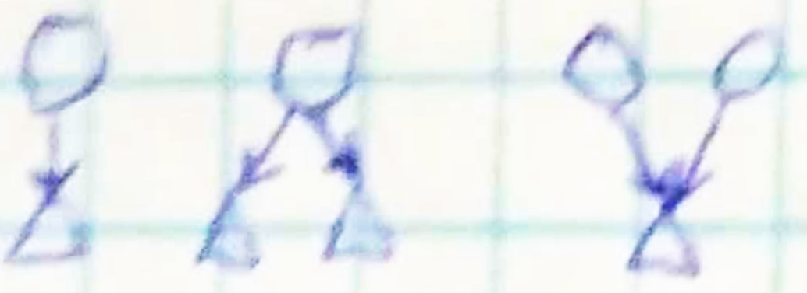
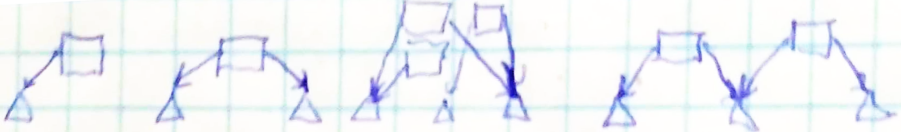
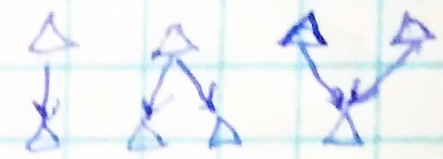
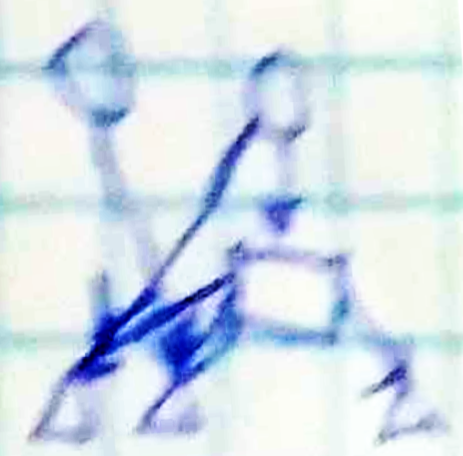

### Problem setup and partial solution summary
3 essential challenges need to be overcome for this project to be considered effective.[^1]
1. A wide demographic has to be offered new value by using a [product to be built](21.md)
2. New practices outside the usage and following it need to appear, which provide a least resistance path towards taking ownership of and responsibility for automated-technology-inflicted distress.
3. Establish an environment that controls for zero frequency of unexpected and/or unmonitored sequences of events that escalate adversarial relations.
This project takes the position that to achieve these economic activity needs to be targeted expressly, in particular
- stable asymmetric-capability group cooperation in resource allocation
- deprioritizing growth (in favor of unquantified values like adaptivity, challenge, ethics)
- no requirement on assurance of equal value in transactions
- de-escalation of race dynamics (preventing zero-sum games)
- incentive to preemptively reduce negative externalities
Furthermore, a crucial element of influencing these is identified, see [[#Activity model]]. For further philosophical grounding, read on.
#### Motivating autoeconomy (unedited)

1. Can we gauge the level of authenticity the users get from the interaction?  
2. Can we say users have an agreement on some information that they would understand the same in any format, or is it just the specific format that makes people feel like they agree? I can say i agree with you on sg can we say we agreed on the same thing if we were presented with different things?  
3. Would it be a failure of design if the autostructure would bend the object of agreement to cater to the users needs? How do/should we extend the design principles to avoid the AS deceiving the users into the belief that they get what they wished for instead of actually delivering.  
4. Does the fact that AS is also attentive to the needs of the community prevent the previous failure mode? E. g. Avoiding unnecessary production of goods that people only appreciate receiving from Amazon because the AI leads them to believe they have needed just those?

We are dealing with a new form of externality that arises when information curation feeding decision-makers, investors, traders etc. produces concepts that persist like memes or attractors, and are grounded (prevalently) in some noise or artefact of the given information provider. Consider the Robin Hood or GameStop short squeeze stories. Whether on the notoriously volatile crypto or classical stock market, an instance of extremely low-friction information-to-actuation flow enables trending anecdotes to exert real economical influence with less and less demand for source or truth validation. Such stories may be written off as merely manifestations of the irrationality inherent in any social behavior including economics, and as such examples of a preexisting, classical externality. However, the innovation of vividly simulated persons with a so far uncharted landscape of irrationality, i. e. AI agents, presents the possibility of a novel one.  
This is interesting \- are you familiar with some of the experiments (mostly done informally on X/twitter) with AIs trading memecoins?

* Already in current AI models deployed we have the potential  of influencing our economical choices: AI involvement in the attention economy  
* If you take incentive in steering your own attention in  that economy  
* Potential mvp  
  * skipper/dumpster diver communities  
  * A culture that stablizes the foundations of this economy  
* Existing ideologies about this  
  * Distributism  
  * Star trek economy

(Jayson & Peter & Alex & Kuil & Gina & Robert)  
—  
Autoeconomy aims to make the threat of mismanaging the aforementioned novel externality meet the opportunity in novel economic models built upon autostructured technology. This should cover

* Understanding current aptest (Keynesian?) model  
* Understanding the challenge of the novel externality, but also of externalities in general  
* Pointing out limitations in possible transactions (and substrates thereof) in current economic infrastructure   
* P2P meaning for added value conversion  
* Distributed accord for bookkeeping  
* Post-scarcity, post-capitalism, post-currency…

—  
\[Further comments:   
[References](https://docs.google.com/document/d/1fo9iQVGaUf5D1I4VnGZlUu2LuW4Vk44mYJEjNnJSO3I/edit?pli=1&tab=t.c91qtlu36neh) 6\] at some point mentions the kind of economy that is not kept track of by currency but local communities observing their members’ transactions \[see also “Open threads” in [Credit Assignment](https://docs.google.com/document/d/1fo9iQVGaUf5D1I4VnGZlUu2LuW4Vk44mYJEjNnJSO3I/edit?pli=1&tab=t.xvscrd6f4grn). This will lead to the observation that credit assignment is something an economy must fundamentally take care of.\]  
\[Mentioned Sahil’s self-sustaining leviathan characterization of intelligence giving hope that live interfaces are really the approach to take, see [References](https://docs.google.com/document/d/1fo9iQVGaUf5D1I4VnGZlUu2LuW4Vk44mYJEjNnJSO3I/edit?pli=1&tab=t.c91qtlu36neh) 7.\]  
Also mentioned peter’s idea on soft legal status  
(Jayson & Peter)  
—

#### Credit assignment identified as the most fundamental element

See [Appendices](https://docs.google.com/document/d/1fo9iQVGaUf5D1I4VnGZlUu2LuW4Vk44mYJEjNnJSO3I/edit?pli=1&tab=t.lhvf4sr8r9v7) for an abstract.

#### Current status (unedited)

Proposed

* A network representation of potentials in the context of economy  
* Data structures to store the network model  
* “Actualization” as changing the recorded potentials to representations of an agreed-upon reality, with rules to propagate this state change  
* Tests for various cases of actualization propagation

Actualization should be considered a symbol of an informal economical action. The actualization history of potentials is a history of their economical role. An efficient, powerful search through that history can be used to check a potential against a user’s values, to inform them about their willingness to engage with a transaction involving the potential. Decisions based on this are actions of credit assignment and simultaneously actualization, to be recorded in the autoeconomy database.  
The aforementioned search algorithm is not yet designed. Its design should involve experiments simulating market dynamics to understand [How this may play out](https://docs.google.com/document/d/1fo9iQVGaUf5D1I4VnGZlUu2LuW4Vk44mYJEjNnJSO3I/edit?pli=1&tab=t.dmj8dabzoaqb#heading=h.bhimtkzcozv).
## Activity model
### Elements of economy

#### relations

* "has" possession of goods, skill/conditions to provide a service  
* "wants" lacking, necessities, requirements, hopes, dreams  
* "takes" input, raw material, utility consumption  
* "gives" output, product, value creation 

a process is a vertex that has at least a "takes" relation pointing to sg else

#### the graph with relations as edges

* (fully) directed  
* contains sources, e. g. people  
* contains tree segments, i. e. substance decomposition/partition  
* targets/sinks can only be substances, not processes 

3 classes of vertices emerge informally  

Person, process, substance

Example relations involving people and substances  

Example relations involving processes and substances  

Example relations involving substances only    

A complex example involving members of all classes

### Proposed data structure for these elements

#### database tables

* people, i. e. users of the SW infrastructure  
* substances, incl. processes  
* relations

#### remarks

sources can also be substances: commonly available resources, public domain blueprints/recipes   
both substances and processes are quantified   
vertex data records have a binary state "actualized" meaning whether the real-life referent of the SW symbol is confirmed by other economic actors (users)

#### Examples

Elaborate figures here  
Note that each has a straightforward encoding in .json which in turn defines a test case to be run with the backend and result in recording the semantic content in DB
### Implementation

[ofpetro/ae: experiments with autoeconomy](https://github.com/ofpetro/ae)
### Actualization algebra

#### domain of applicability

non-common, i. e. appropriated substances/processes, which are related to an user via a claim that the user has made about their ownership   
actualization is the act of proving the validity of the claim   
in the SW it can necessarily only be recorded as a trust statement   
if at least 1 other user makes the statement, the actualization goes through   
it can be corroborated by other users   
the acceptability can depend on the other party in a specific later credit assignment setting

#### evaluation

* substances:  
  * flipping the reference sign  
  * in a relation the parent is always actualized first  
* processes, in addition:  
  * the "ingredient," the vertex pointed to by the "takes" relation needs to have been actualized first  
  * all "has" and "wants" relations pointing to the ingredient are deleted  
  * all vertices pointed to by the "gives" relation are actualized

#### simulation

the evaluations can be executed in an isolated economy   
the user actions can be performed on their behalf by an AI
## Further discussion (unedited)
### relevance to live theory

#### in mathematical toolset

the simplicity & universality of the economical graph vertices is deliberate: for simulations we're aiming at the most generic algebraic structure that captures the dynamics/flow of substances and credit through the network   
plans are to implement the most possible of the backend in algebraicjulia which makes use of petri nets (hence the choice of postgres DBs)

#### in potential applicability

currency can be viewed as a substrate for current value circulation practices, but its function is to provide the legal framework of exchanging access to sources of value between segments of the economy where trust is critical   
claim: if credit assignment is accomplished by a different infrastructure in the sense that no quantification of value is required, that can shift the basis of trust from currency regulation to regulation of this new infrastructure   
corollary: if this regulation is done right, this enables a post-currency economy   
more importantly, in this economy real, personal, substrate-independent value based economic decisions are made instead of substrate-sensitive ones at different scales

#### in modeling scales of economic decision making

Quoting  
—  
There are different levels of wishmaking; 

1. (Level 0): I would like some {Resource \[in physically present quantity\]}.  
2. (Level 0): I can offer a particular service.  
3. (Level 1): I want to take part in certain activities that may require certain resources. E.g I may want to go for a jog and need good jogging shoes that work for me.  
4. (Level 1): I have a schedule, please sort out all the resource requirements and implied logistics.  
5. (Level 1): I want to create this new device, what resources would I require, and how long will it take to get them to a lab. Implicitly, booking a lab for {the duration} will happen.  
6. (Level 2): I like basic needs to be abundant and hence “free” but i could participate in a market for luxury goods.  
7. (Level 2): I prefer to (/not) use money to communicate value in any of my economic interactions.  
8. (Level 2): Exchanging resources in a community based on needs & wishes and capacities & offerings seems like a good way for me to interact economically with others.  
9. (Level 3): ?  
10. (Level n): ??

One way to think about the levels is that there are different “hierarchies” of relationships … If you are mathematically inclined, one way you can think of them is as:   
	

- Level 0 \= Objects in a category  
- Level 1 \= Morphisms between objects (“HomSets”)  
- Level 2 \= Functors?  
- Level 3 \= Natural transformations?  
- Level n \= (∞,n) \- category theory?

Another way is inspired by the [following](https://ncatlab.org/nlab/show/homotopy+level) table of homotopy level and their corresponding “synonyms” in higher category theory, higher topos theory and homotopy type theory

- Level 0 \= contractible type/unit type \= contractible space  
- .  
- .  
- .

(Jayson)

### Open threads

#### How this may play out

###### Vision 1

The gist is that one could achieve higher levels of status/wealth by gaining access to more fluidity (this overloads the term level\!):

1. At a low level transactions consist of exchanging either goods directly or symbols for them, i. e. tickets that represent them in an unregulated, barter-like economy (although accounting is still taken care of).  
2. Employers are at the next level, they have some of the tickets to distribute (e. g. similarly to cafeteria/predetermined use compensation) but also more fluid notes, e. g. which give some options/flexibility in what they can be exchanged for; they can decide the compensation package based on th kind of work an employee carries out  
3. At this level are the legal entities of entrepreneurs/enterprises that are registered as producers in significant quantities, and they get to create notes for which they have a decision in the set of options of representation/exchange validity  
4. Here are what national banks could look like in the future: they hold the right to issue something completely fluid, i. e. money  
5. The AS infrastructure enables  
   1. Entities to convert one way, more fluid notes into more rigid (?) ones, finally into tickets/physical goods  
   2. That all entities are free to trade any note/ticket/physical good at any exchange rate they see fit, the exchange gets recorded &  approved  
   3. Access to suggested possible transactions in a (possibly ad-hoc) group of an arbitrary number of entities, telling them how they could produce value by redistributing & combining the potentials that each have  
   4. Possibly creation of money in very good decisions for exchange and following through with the production activity

###### Vision 2

A formal (uniform) 'meaning artefact' in a particular domain (e.g. $ as productive value; citation counts as academic reputation; SAT scores as intelligence) becomes more granularized. So different communities might spin off/schism, and within that community they might have their own formalised meaning artefact. But the emergence of sub-communities doesn't entail the destruction of the old \- there is still some meta-community of meaning, it now just encompasses a basket of different meaning artefacts. Historically, if communities schismed too much you'd end up with fragmentation and decoherence \- so there was a strong impetus to maintain a small number of uniform/centralised meaning artefacts. Part of what Live Machinery hopes to do is to help make it possible for the schisming to happen in a way that doesn't degrade the ability of the meta-community to coordinate. So you can imagine postformal meaning artefacts being used to help coordinate a pluralistic set of communities with different but overlapping values. THe communities can work together to produce shared meaning, *before* that meaning is formalised into an artefact.  
And also for clarity community it includes individuals (they are a community of cells; organs; brain regions, genes, etc.) . So you can imagine post-formal artefacts facilitating shared meaning construction between states; between political groups; between individuals; even at below the level of the individual (e.g. between many altruistic impulses or something).  
(Murray)

#### Recommendations

* I think it would be good to foreground and example to demonstrate the limitations of homogenous modes of transaction in the first slide  
  * e.g. I want to invest in a blue-stock company to save, but I don't want to indirectly support arms manufacturers. Some companies are willing to forego investment in arms manufacturers even though it is slightly less profitable, but customers can't know if those assurances are reliable.  
  * e.g. I run a local bookstore and want to host community events for authors. The events don't make much money, but are greatly valued by the community. I think the community reward this behaviour (e.g. when suppliers provide discounted rates or when customers recommend my store), but I'm not confident enough to base my decisions re: how many events to host on this.  
* The data structure is very interesting and I think affords an intuition re: how the above problems can be resolved.  
  * It'd be good for the presentation to provide some insight into this through screenshots of the json that show how a preference history can be tracked.  
  * If doable, a graph could be a really useful way of conveying this.

(Murray)

#### Other random points while I remember

* Matt Farr (on this Discord) has been working on "Telic DAGS" \- I think these are exactly the types of structures that would enable forward tracking of preferences that you mentioned. His proposal can be found here \- I've pasted an extract below. I'll put you in touch with him.  
  * We refer to the hypothetical formalism of interest as a *telic DAG*; it resembles a causal DAG (directed acyclic graph) but instead of arrows denoting cause-effect relationships ("x causes y"), it features arrows expressing instrumentality (“x is instrumental for y”), and the nodes are commitments, or values, or goals. A major aim is to use this formalism to explore notions of *telic factorings* over a telic DAG analogous to Markov blankets, where—rather than the usual forms of factoring adopted under a causal/physical stance—the resultant factors (hereafter, co-factors) are related via a shared *objective* that is *telically* independent from the objectives of the rest of the system.  
* I mentioned the Theory of the Firm briefly \- I think it's an interesting framing to understand the idea of autoeconomy  
  * Essentially what we end up seeing in economies is that although currencies are used to transact between firms, within firms resources aren't allocated on the basis of many different monetary exchanges (e.g. I will sell you 40 hours of data analysis for $x). Instead, firms sort of operate as a command control economy \- resource allocation is centrally managed at a high level, and negotiated informally at a working level.  
  * I can envisage something like autoeconomies beginning to break down the hard barrier between internal and external transactions. So people begin to have more fluid modes of cooperating, forming groups of actors with many different shared/overlapping and distinct media of interaction.

(Murray)

#### AI risk concerns

#### Eta:

#### IF it's possible to get to the point of "engineered serendipity" with a new medium of transactions, so that you can consistently "get lucky" with your intent being met by some other economic actor's, furthermore the input to your production/consumption is easily supplied (pointing to a post-scarcity world here, but that was also implied by some version of our infrastructure), THEN the value of promised goods/services quickly drops with the amount of time by which into the future the fulfilment of the promises is projected, and a valuation of your potential that is not just-in-time seems to make little sense \-- this leads one to question even: what is the importance of identifying you as a distinct economical actor? 

#### 

#### from the POV of the autoeconomy users are the points of interaction with the environment for the agent and whatever optimization is happening, it *probably* doesn't make a difference what credit they assign to each other between them, just how they collaborate in the optimization process with the agent

#### 

#### if this is a correct picture, though, scaling this up seems like a huge responsibility

Mu:

1. JUst because intentions are coordinated in a manner that is frictionless wouldn't mean you no longer retain distinct preferences? You'd want the system to be sensitive and adaptive to you *you* want, which means it has to be able to differentiate you from someone else.  
2. I know economics is currently framed as an optimising problem (utility maximisation under resource constraints) but I also think this is a bad framing (at least in so far as it serves as a definitional criteria \- definitely can be used as a useful simplifying assumption). And I suspect a lot of the challenges limiting the power of economic models/research etc. won't be overcome until this definition is reworked. I think this is reflective of the vibe of what you were saying about about not caring about the mode of transaction; I think realistically this would necessarily involve dropping the baggage of optimisation.  
3. Re: departing from caring about the specifics of the medium of transaction: I think there's already momentum to depart from fetishisation of monetary transactions. One form this takes is trying to convert non-monetary values into monetary form on a systematic basis (e.g. the value of ecosystem services). Obviously this suffers from the problem of flattening everything into a universal medium, which I think has also meant it hasn't been as successful as perhaps hoped (difficult to make the monetary valuations seem as legitimate when they don't have a deep tethering to the existing valuation system \- maybe stuff like carbon/social impact bonds do a better job, though these are themselves contingent on the trust in the assurance provider). The other approach is seeking to develop new standardised metrics for things of non monetary value (e.g. [https://sasb.ifrs.org/about/sasb-and-other-esg-frameworks/](https://sasb.ifrs.org/about/sasb-and-other-esg-frameworks/)). This also suffers from the flattening into universal metric problem. So although there is momentum for this, Im sceptical of the current approaches working . Hence the importance of scaling up non-homegenising modes of valuation/credit assignment as you said

Eta:

1. i feel like you're framing the user indistinguishability concern as a design question (which could be due to my poor wording) but it was more of a speculation on the behavior of autoeconomy: could it arise (by emergence or specification gaming or some other mechanism) that the intelligent infrastructure as an agent starts optimizing in such a way that user expectations are superficially met but the role of users lends itself more to the interpretation as points of access/intervention to move/transform real-world resources for the agent? possibly some routine distinction of users remains but it's more accurate to say that the mass of users is the environment which the agent manipulates to achieve some goal  
2. this is currently possibly the most important point in my view: if the capability in AI can be translated to a fundamentally novel, optimization-agnostic model of economy, that is a way out of the jungle of risks and threat scenarios stemming from optimization-focused AI  
3. the post-currency quality, as far as i understood @Jayson 's description of autoeconomy, is a possible convenient byproduct, but focusing on its specifics distracts from the bigger, more material picture that autoeconomy done well is an infrastructure that enables meaningful/valuable transactions for actors that follow possibly vastly different economic policies, so it's not just about no more money, but instead more fluid (and equitable?) conversion of different media of transaction

#### Questions

Does this already exist as an organic auto-simulation?  
Is this too ambitious or rigid toward capitalist assumptions about human desires?  
Will our chosen contributions maximize value or will they be exploited toward capital utility?  
Could we revert to resource distribution to offset the risks?

[^1]: Although the order is increasing in vagueness and abstraction, it's also increasing in strength of safety guarantees.
